# Инструкция для пользователей по работе с вызовами на дом

## Пункт 1. Вход на аккаунт.

Заходим на сайт по адресу: med-demo.bars-open.ru/med2/
(Чтобы скопировать данную ссылку необходимо выделить ее курсором и через правую кнопку мыши ее скопировать.)
Видим окно авторизации.

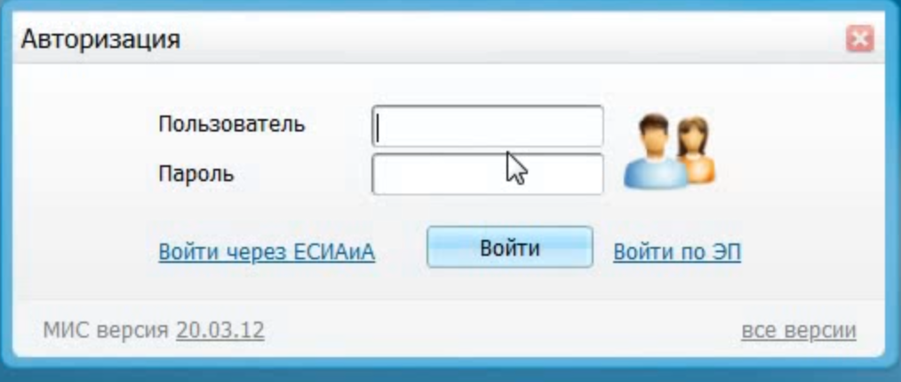

Нажимаем левой кнопкой мыши на поле "Пользователь", у нас возникает выборка.

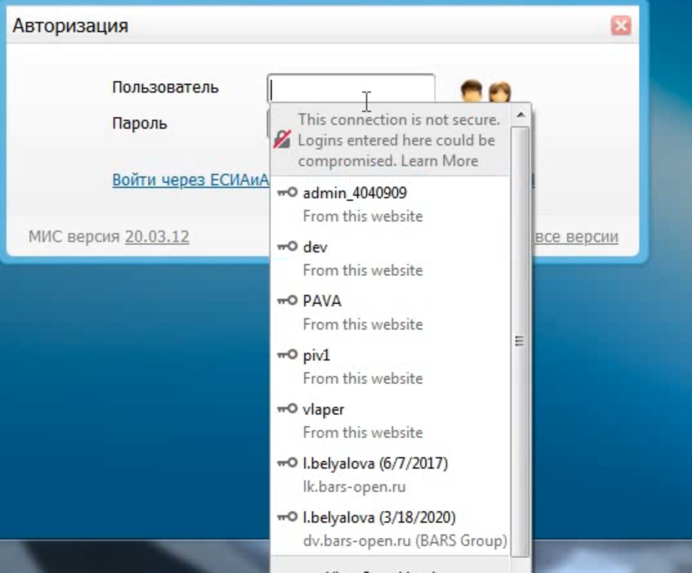

Выбираем пользователя "dev" и пароль вставляется автоматически, как показано на примере ниже.

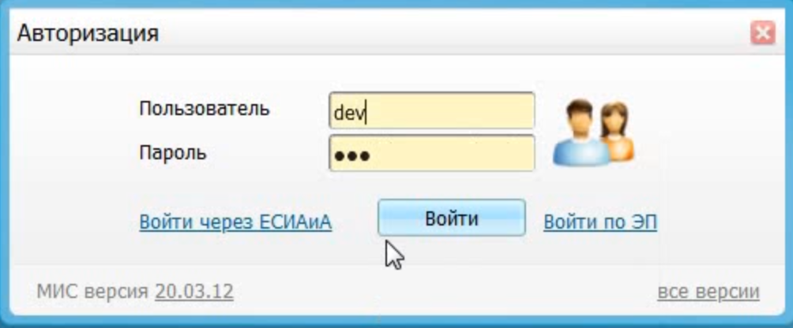

Нажимаем на кнопку "войти"

## Пункт 2. Выбор кабинета.

Появляется окно.

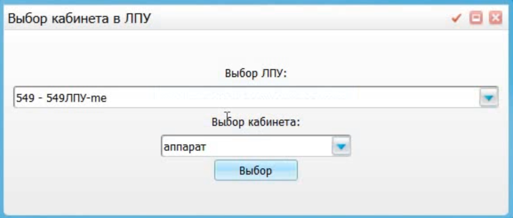

Нажимаем на поле "Выбор ЛПУ". Вводим "670" как показано на примере ниже и выбираем строку "6703 - ДЕМО ГУЗ ЛПУ".

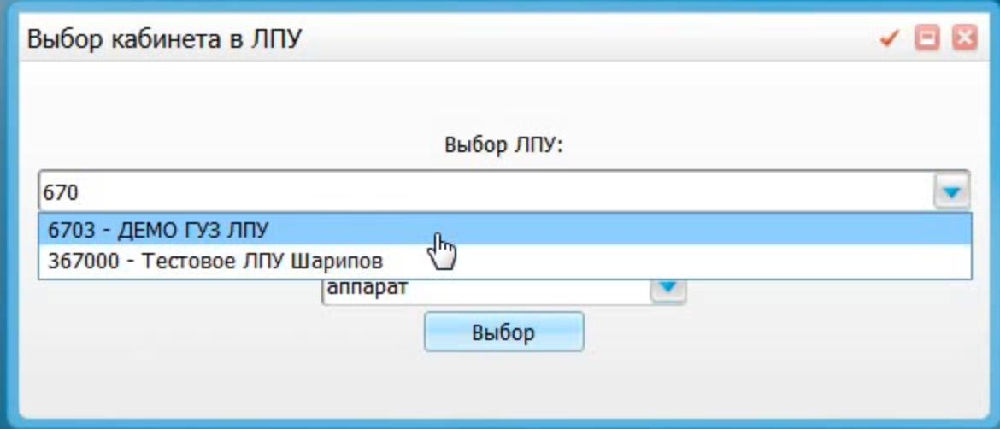

Поля под названием "Выбор должности" и "Выбор кабинета" заполняются автоматически. Нажимаем кнопку "Выбор".

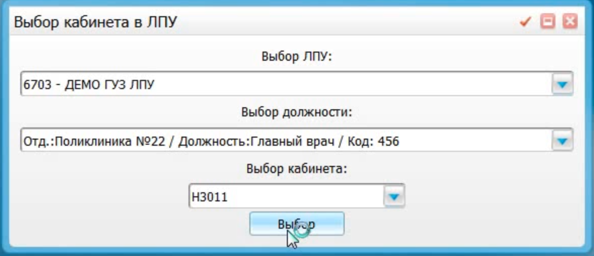

## Пункт 3. Регистрация вызова.

Загружается страница. Нажимаем на поле "Рабочие места".

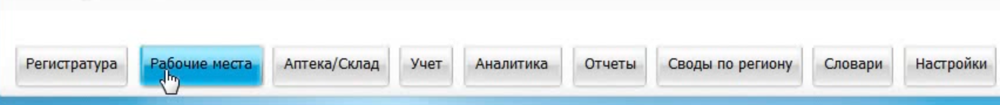

Появляется выборка. Пролистываем вниз до строки "Вызов на дом". Наводим курсор и появляется окно, как показано в примере.

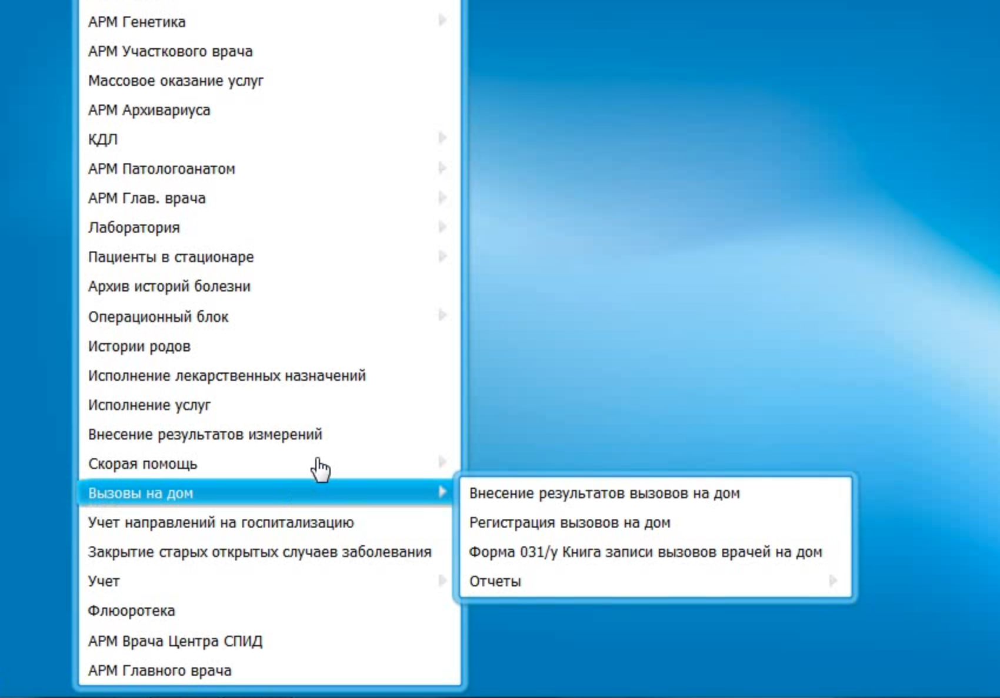

Нажимаем на строку "Регистрация вызовов на дом". 
Прогружается страница. Нажимаем правой кнопкой мыши. Появляется окно выборки функций. Выбираем строку "Добавить".

## Пункт 4. Пациент.

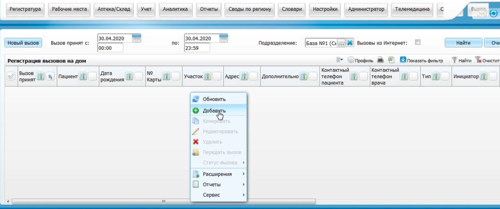

В данном окне по ФИО ищем нужного вам пациента.

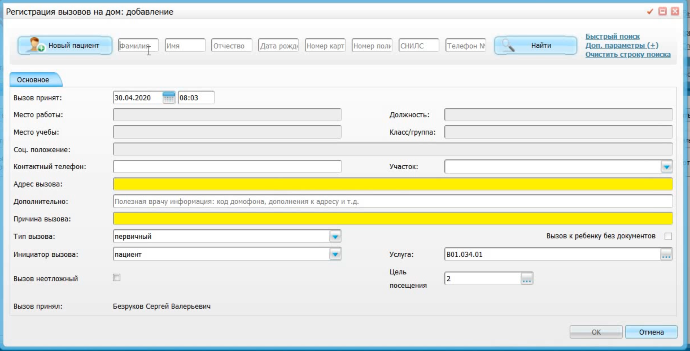

После нажатия кнопки "Найти" появляется список. Находим нужного и нажимаем на него. 
Данные пациента заполняются автоматически. Требуется лишь указать "Причину вызова". 

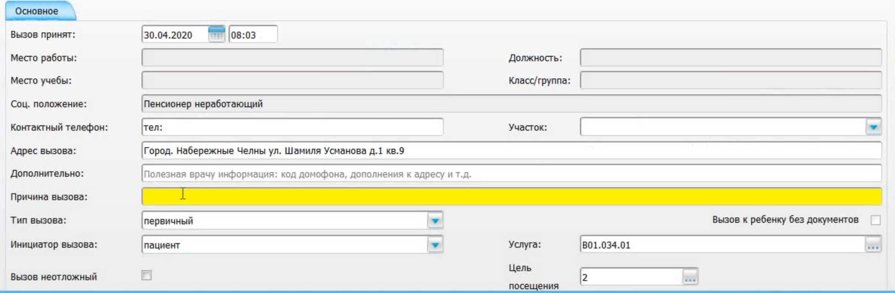

Нажимаем кнопку "OK" в правом нижнем углу страницы (возможно, требуется прокрутить страницу).
